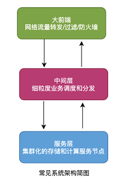

# 分布式系统与一致性哈希

## 分布式

### 系统概览

高并发和海量数据处理等场景越来越多，实现服务应用的高可用、易扩展、短延时等成为必然。

在此情况下分布式系统应运而生，互联网的场景无外乎存储和计算，因此分布式系统可以简单地分为：

- 分布式存储
- 分布式计算

可以简单认为分布式系统就是一批物理不相邻的计算机组合起来共同对外提供服务。

对于用户来说具体有多少规模的计算机完成了这次请求，完全是无感知的。

分布式系统中的计算机越多，意味着计算和存储资源等也就越多，能够处理的并发访问量也就越大，响应速度也越快。

如图为简单整体架构：



### 分布式与集群化

集群是从原来的单机演变来的，单台机器扛不住就加机器，直到服务负载、稳定性、延时等指标都满足。

集群中的N台机器上部署一样的程序，就像一台机器被复制多份一样，这种形式就是集群化。

分布式是将一个完整的系统，按照业务功能拆分成一个个独立的子系统，这些服务之间使用更高效的通信协议比如RPC来完成调度，各个子服务就像在一台机器上一样，实现了业务解耦，同时提高了并发能力确实不赖。

一个大的分布式系统可以理解拆分之后的子服务使用集群化，一个个子服务之间使用类似于RPC的协议串联，组成一个庞大的存储和计算网络。

如图为简单的分布式系统结构：


### 集群化遇到的问题

我们以分布式存储系统为例子，来说明一致性哈希算法的用武之地。

对于集群来说，机器多了就不好管理，必然会有机器物理故障，业务扩缩容也非常正常，机器的调整必然带来数据的迁移。

如果存储集群中有5台机器，如果这时有读写请求，就需要考虑从哪台机器操作数据，一般有几种方法：

- 随机访问
- 轮询策略
- 权重轮询策略
- Hash取模策略
- 一致性哈希策略

各种方法都有各自的优缺点：

- 随机访问可能造成服务器负载压力不均衡；
- 轮询策略请求均匀分配，但当服务器有性能差异，无法按性能分发；
- 权值需要静态配置，无法自动调节；
- 哈希取模如果机器动态变化会导致路由产生变化，数据产生大量迁移。

实际中对于规模较小的系统来说，哈希取模策略应用很广泛，接下来重点介绍**hash取模和一致性哈希的区别与联系**。


### Hash取模

Hash取模策略是其中常用的一种做法，它可以保证相同请求相同机器处理，这是一种**并行转串行**的方法，工程中非常常见。

如果数据相对独立，就避免了线程间的通信和同步，实现了无锁化处理，所以还是很有用的。

```go
index = hash_fun(key) % N
```

从上面的普通hash取模公式可以看到，如果N不变或者可以自己主动控制，就可以实现数据的负载均衡和无锁化处理，但是一旦N的变化不被控制，那么就会出现问题。

来看看哈希取模策略是如何应对扩缩容问题的，特别注意，为了简化问题模型，接下来的例子不考虑实例的主从配置。

- **风平浪静 齐头并进**

目前有N=4台机器S1-S4，请求拼接key通过hash函数%N，获取指定的机器序号，并将请求转发至该机器。


- **磁盘故障 请求支援**

S3机器因为磁盘故障而宕机，这时代理层获得故障报警调整N=3，这时就出现了问题，如果作为缓存使用，S3机器上的所有key都将出现CacheMiss。

原来存放在S1的key=abc使用新的N，被调整到S4，这样abc也出现CacheMiss，因为在S4上找不到abc的数据。

这种场景就是牵一发而动全身，在缓存场景中会造成缓存击穿，如果量很大会造成缓存雪崩。


- **兄弟顶住 救兵来了**

由于S3宕机了，因此管理员增加了一台机器S5，代理层再次调整N=4，此时又将出现类似于阶段二的数据迁移，仍然会出现CacheMiss的情况。


## 一致性哈希算法

先来看看维基百科的英文定义：

> in computer science, consistent hashing is a special kind of hashing such that when a hash table is resized, only  K/n keys need to be remapped on average, where K is the number of keys, and n is the number of slots.

简单翻译一下：

> 一致哈希 是一种特殊的哈希算法。 
>
> 在使用一致哈希算法后，哈希表槽位数（大小）的改变平均只需要对K/n 个关键字重新映射，其中 K是关键字的数量，n是槽位数量。 
>
> 在传统的哈希表中，添加或删除一个槽位的几乎需要对所有关键字进行重新映射。

从定义可以知道，一致性哈希是一种特殊的哈希算法，区别于哈希取模，这种特殊的哈希算法实现了少量数据的迁移，避免了几乎全部数据的移动，这样就解决了普通hash取模的动态调整带来的全量数据变动。


### 算法思想

先不看算法的具体实现，先想想普通hash取模的问题根源是什么？

**没错！根源就在于N的变动和数据归属问题。**

- **N的变动**

那么如果N被固定住呢？

如果让N很大，那么每次被移动的key数就是K_all/Slot_n，也就是有槽位的概念，或者说是小分片的概念，直白一点就是鸡蛋放到了很多很多的固定数量的篮子里：

```go
var Key_all int //存储的全部key的数量
var Slot_n int //总的槽位或者分片数
var Min_Change int //为最小移动数量,也是数据的最小分片Shard
Min_change = Key_all/Slot_n
```

- **小分片的归属**

这里还有一个问题要解决，将N固定且设置很大之后，数据分片shard变得非常小了，这时就有shard的所属问题。

也就是比如N=100w，此时集群有10台，那么每台机器上理论上平均有10w，当然可以根据机器的性能来做差异化的归属配置，性能强的多分一些shard，性能差的少分一些shard。

问题到这里，基本上已经守得云开见月明了，不过还是来看看1997年麻省理工发明的一致性哈希算法原理吧。


### Karger的一致性哈希算法

> 一致性哈希算法在1997年由麻省理工学院的Karger等人在解决分布式Cache中提出的，设计目标是为了解决因特网中的热点(Hot spot)问题，初衷和CARP十分类似。
>
> 一致性哈希修正了CARP使用的简单哈希算法带来的问题，使得DHT可以在P2P环境中真正得到应用。

一起看看Karger的一致性哈希算法的基本原理以及如何应对扩缩容问题的。

- **哈希环分片**

正如我们前面的思考，Karger的一致性哈希算法将N设置为2^32，形成了一个0~(2^32-1）的哈希环，也就是相当于普通Hash取模时N=2^32。


再将数据key进行hash计算时就落在了0~(2^32-1的哈希环上，如果总的key数量为Sum，那么单个哈希环的最小单位上的key数就是：

```go 
Unit_keys = Sum/2^32
```

由于N非常大所以哈希环最小单位的数据量unit_keys小了很多。

- **服务节点和哈希环分片**

将服务器结点也作为一种key分发到哈希环上：

```go
con_hash(ip_key)%2^32
```


一致性哈希算法使用顺时针方法实现结点对哈希环shard的归属，但是由于服务器结点的数量相比2^32会少非常多，因此很稀疏，就像宇宙空间中的天体，你以为天体很多，但是相比浩渺的宇宙还是空空如也。

- **一致性哈希的不均衡**

实体服务器结点少量相比哈希环分片数据很少，这种特性决定了一致性哈希的数据倾斜，由于数量少导致服务节点分布不均，造成机器负载失衡。

如图所示，服务器1的负载远大于其他机器:


- **虚拟节点的引入**

这个说白了服务器结点不够，就让服务器的磁盘、内存、CPU全去占位置，现实生活中也这样：12306出来之前，火车站连夜排队买票，这时什么书包、水杯、眼镜都代表了张三、李四、王二麻子。

同样的道理，将服务器结点根据某种规则来虚拟出更多结点，但是这些虚拟节点就相当于服务器的分身。

比如采用如下规则在ip后缀增加#index，来实现虚拟节点的定位：

```go
vnode_A_index = con_hash(ip_key_#A)%2^32
vnode_B_index = con_hash(ip_key_#B)%2^32
...
vnode_k_index = con_hash(ip_key_#k)%2^32
```

这是由于引入了虚拟节点，因此虚拟节点的分片都要实际归属到真实的服务节点上，因此在实际中涉及到虚拟节点和实体结点的映射问题。


- **新增服务器结点**

当管理员新增了服务器4时，原来在服务器3和服务器1之间分布的哈希环单元上的数据，将有一部分迁移到服务器4，当然由于虚拟节点的引入，这部分数据迁移不会很大。

并不是服务器4和服务器1之间的数据都要顺时针迁移，因此这样就实现了增加机器时，只移动少量数据即可。


- **删除服务器结点**

当服务器结点2发生宕机，此时需要被摘除进行故障转移，原来S2以及其虚拟节点上的数据都将进行顺时针迁移到下一个实体结点或者虚拟结点。


### Redis的一致性哈希实现

Redis cluster 拥有固定的16384个slot，slot是虚拟的且被分布到各个master中，当key 映射到某个master 负责slot时，就由对应的master为key 提供服务。

每个Master节点都维护着一个位序列bitmap为16384/8字节，也就是Master使用bitmap的原理来表征slot的下标，Master 节点通过 bit 来标识哪些槽自己是否拥有，比如对于编号为1的槽，Master只要判断序列的第二位是不是为1即可。

这样就建立了分片和服务结点的所属关系，所以整个过程也是两个原则，符合上文的一致性哈希的思想。

```go
hash_slot_index = CRC16(key) mod 16384
```


## 总结

###  一致性哈希算法的两个关键点

一致性哈希算法是一种特殊的哈希算法，特殊之处在于将普通哈希取模的N进行固定，从而确保了相同的key必然是相同的位置，从而避免了牵一发而动全身的问题，这是理解一致性哈希的关键。

一致性哈希算法的另外一个要点就是将N固定且设置很大之后，实际上就是进行数据分片Sharding，分布的小片就要和实际的机器产生关联关系，也就是哪台机器负责哪些小分片。

但是一致性哈希算法并不是从彻底解决了由于动态调整服务器数据产生的数据迁移问题，而是将原来普通哈希取模造成的几乎全部迁移，降低为小部分数据的移动，是一种非常大的优化。

个人认为，一致性哈希算法的关键有两点：

- 大量固定数量的小数据块的分片
- 小分片的服务器归属问题