# 递归

#### **什么是递归**

简单地说，就是如果在函数中存在着调用函数本身的情况，这种现象就叫递归。

以阶乘函数为例,如下, 在 factorial 函数中存在着 factorial(n - 1) 的调用，所以此函数是递归函数

```go
func factorial(n int) int{
    if n <= 1 {
        return 1
    }
    return n * factorial(n - 1)
}
```

进一步剖析「递归」，先有「递」再有「归」，「递」的意思是将问题拆解成子问题来解决， 子问题再拆解成子子问题，...，直到被拆解的子问题无需再拆分成更细的子问题（即可以求解），「归」是说最小的子问题解决了，那么它的上一层子问题也就解决了，上一层的子问题解决了，上上层子问题自然也就解决了,....,直到最开始的问题解决,文字说可能有点抽象，那我们就以阶层 f(6) 为例来看下它的「递」和「归」。

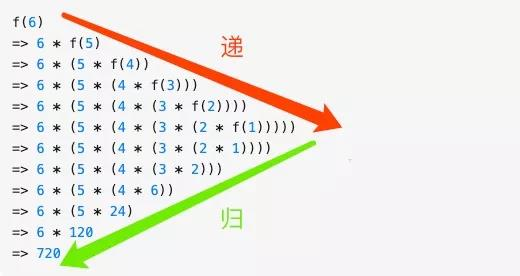

求解问题 f(6), 由于 f(6) = n * f(5), 所以 f(6) 需要拆解成 f(5) 子问题进行求解，同理 f(5) = n * f(4) ,也需要进一步拆分,... ,直到 f(1), 这是「递」，f(1) 解决了，由于 f(2) =  2 f(1) = 2 也解决了,.... f(n)到最后也解决了，这是「归」，所以递归的本质是能把问题拆分成具有**相同解决思路**的子问题，。。。直到最后被拆解的子问题再也不能拆分，解决了最小粒度可求解的子问题后，在「归」的过程中自然顺其自然地解决了最开始的问题。


#### 递归的特点

1. 自身调用 : 一个问题可以分解成具有**相同解决思路**的子问题，子子问题，换句话说这些问题都**能调用同一个函数**
2. 终止条件 : 经过层层分解的子问题最后一定是有一个**不能再分解的固定值**的（即终止条件）,如果没有的话,就无穷无尽地分解子问题了，问题显然是无解的。

解递归题的关键在于我们首先需要根据以上递归的两个特点判断题目是否可以用递归来解。


#### 通用解决思路

经过判断可以用递归后，接下来我们就来看看用递归解题的基本套路（四步曲）：

1. 先定义一个函数，**明确这个函数的功能**，由于递归的特点是问题和子问题都会调用函数自身，所以这个函数的功能一旦确定了， 之后只要找寻问题与子问题的递归关系即可
2. 接下来寻找问题与子问题间的关系（即**递推公式**），这样由于问题与子问题具有**相同解决思路**，只要子问题调用步骤 1 定义好的函数，问题即可解决。所谓的关系最好能用一个公式表示出来，比如 **f(n) = n \* f(n-1)** 这样，如果暂时无法得出明确的公式，用伪代码表示也是可以的, 发现递推关系后，**要寻找最终不可再分解的子问题的解**，即（临界条件），确保子问题不会无限分解下去。由于第一步我们已经定义了这个函数的功能，所以当问题拆分成子问题时，子问题可以调用步骤 1 定义的函数，符合递归的条件（函数里调用自身）
3. 将第二步的递推公式用代码表示出来补充到步骤 1 定义的函数中
4. 最后也是很关键的一步，根据问题与子问题的关系，推导出时间复杂度,如果发现递归时间复杂度不可接受，则需**转换思路对其进行改造**，看下是否有更靠谱的解法


#### 实战演练

##### 热身赛

> 输入一个正整数n，输出n!的值。其中n!=1*2*3*…*n,即求阶乘

1.定义这个函数，明确这个函数的功能，我们知道这个函数的功能是求 n 的阶乘, 之后求 n-1, n-2 的阶乘就可以调用此函数了

```go
/**
 * 求 n 的阶乘
 */
func f(n int) {
}
```

2.寻找问题与子问题的关系 阶乘的关系比较简单， 我们以 f(n) 来表示 n 的阶乘， 显然 f(n) = n * f(n - 1),  同时临界条件是 f(1) = 1,即

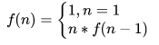

3.将第二步的递推公式用代码表示出来补充到步骤 1 定义的函数中

```go
/**
 * 求 n 的阶乘
 */
func f(n int) int {
    // 第二步的临界条件
    if n <=1 {
        return 1;
    }

    // 第二步的递推公式
    return n * f(n-1)
}
```

4.求时间复杂度由于  f(n) = n * f(n-1) = n * (n-1) * .... * f(1),总共作了 n 次乘法，时间复杂度为 n。


##### 入门题

> ```
> 一只青蛙可以一次跳 1 级台阶或一次跳 2 级台阶,例如:跳上第 1 级台阶只有一种跳法：直接跳 1 级即可。跳上第 2 级台阶有两种跳法：每次跳 1 级，跳两次；或者一次跳 2 级。问要跳上第 n 级台阶有多少种跳法？
> ```

1.定义一个函数，这个函数代表了跳上 n 级台阶的跳法

```go
/**
 * 跳 n 极台阶的跳法
 */
func f(n int) {
}
```

2.寻找问题与子问题之前的关系 这两者之前的关系初看确实看不出什么头绪，但仔细看题目，一只青蛙只能跳一步或两步台阶，**自上而下地思考**，也就是说如果要跳到 n 级台阶只能从 从 n-1 或 n-2 级跳， 所以问题就转化为跳上 n-1 和 n-2 级台阶的跳法了，如果 f(n) 代表跳到 n 级台阶的跳法，那么从以上分析可得 f(n) = f(n-1) + f(n-2),  显然这就是我们要找的问题与子问题的关系,  而显然当 n = 1, n = 2， 即跳一二级台阶是问题的最终解，于是递推公式系为

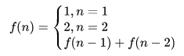

3.将第二步的递推公式用代码表示出来补充到步骤 1 定义的函数中 补充后的函数如下

```go
/**
 * 跳 n 极台阶的跳法
 */
func f(n int) int{
    if n <= 2 {
		return n
	}
    return f(n-1) + f(n-2)
}
```

4.计算时间复杂度 由以上的分析可知 f(n) 满足以下斐波那契公式


斐波那契的时间复杂度计算涉及到高等代数的知识, 这里不做详细推导, 我们直接结出结论

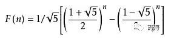

由些可知时间复杂度是指数级别，显然不可接受，那回过头来看为啥时间复杂度这么高呢,假设我们要计算 f(6),根据以上推导的递归公式，展示如下

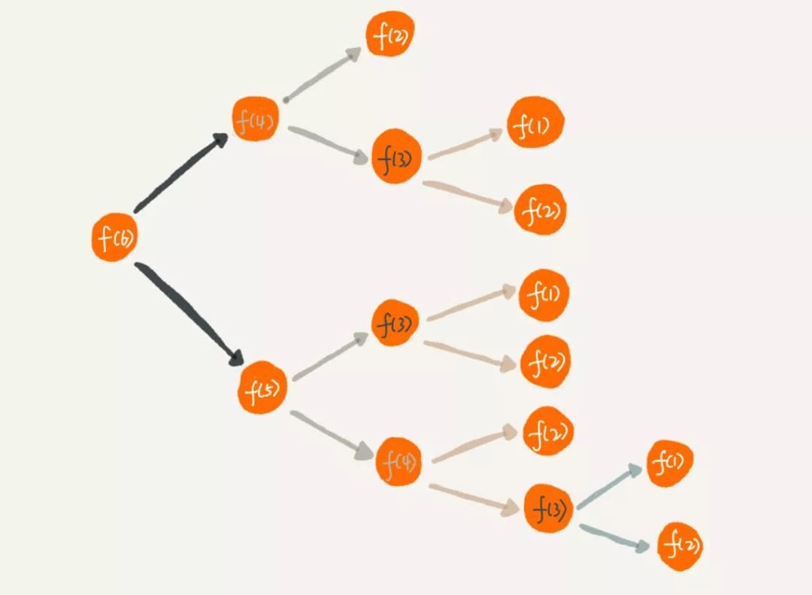

可以看到有大量的重复计算, f(3) 计算了 3 次， 随着 n 的增大，f(n) 的时间复杂度自然呈指数上升了

5.优化 

既然有这么多的重复计算，我们可以想到把这些中间计算过的结果保存起来，如果之后的计算中碰到同样需要计算的中间态，直接在这个保存的结果里查询即可，这就是典型的 **以空间换时间**,改造后的代码如下

```go
func f(n int, m map[int]int) int {
	if n <= 2 {
		return n
	}
	// map 即保存中间态的键值对
	if v, ok := m[n]; ok{
		return v
	}
	return f(n-1, m) + f(n-2, m)
}
```

那么改造后的时间复杂度是多少呢，由于对每一个计算过的 f(n) 我们都保存了中间态 ，不存在重复计算的问题，所以时间复杂度是 O(n), 但由于我们用了一个键值对来保存中间的计算结果，所以空间复杂度是 O(n)。问题到这里其实已经算解决了，但身为有追求的程序员，我们还是要问一句,空间复杂度能否继续优化?

6.使用循环迭代来改造算法 我们在分析问题与子问题关系（**f(n) = f(n-1) + f(n-2)**）的时候用的是**自顶向下**的分析方式,但其实我们在解 f(n) 的时候可以用**自下而上**的方式来解决，通过观察我们可以发现以下规律

```
f(1) = 1
f(2) = 2
f(3) = f(1) + f(2) = 3
f(4) = f(3) + f(2) = 5
....
f(n) = f(n-1) + f(n-2)
```

最底层 f(1), f(2) 的值是确定的，之后的 f(3), f(4) ,...等问题都可以根据前两项求解出来，一直到 f(n)。所以我们的代码可以改造成以下方式

```go
func f(n int) int {
	if n <= 2 {
		return n
	}
	per,cur,result := 1,2,0
	for i := 3; i <= n; i ++{
		result = per + cur
		per = cur
		cur= result
	}
	return result
}
```

改造后的时间复杂度是 O(n), 而由于我们在计算过程中只定义了两个变量（pre，next），所以空间复杂度是O(1)

简单总结一下：分析问题我们需要采用**自上而下**的思维，而解决问题有时候采用**自下而上**的方式能让算法性能得到极大提升,**思路比结论重要**


##### 初级题

接下来我们来看下一道经典的题目: 反转二叉树 将左边的二叉树反转成右边的二叉树

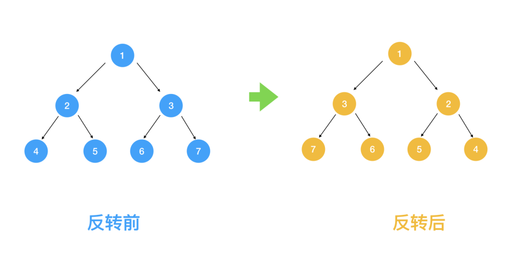

接下来让我们看看用我们之前总结的递归解法四步曲如何解题 

1.定义一个函数，这个函数代表了翻转以 root 为根节点的二叉树

```go
func f(root *Node)  *Node{
	if root == nil {
		return nil
	}
	temp := root.left
	root.left = f(root.right)
	root.right = f(temp)
	return root
}
```

2.查找问题与子问题的关系,得出递推公式 我们之前说了，解题要采用自上而下的思考方式，那我们取前面的1,2,3 结点来看，对于根节点 1 来说，假设 2,3 结点下的节点都已经翻转，那么只要翻转 2,3 节点即满足需求


对于2， 3 结点来说，也是翻转其左右节点即可,依此类推,对每一个根节点，依次翻转其左右节点，所以我们可知问题与子问题的关系是 翻转(根节点) =  翻转(根节点的左节点) + 翻转(根节点的右节点) 即 

**invert(root) = invert(root.left) + invert(root.right)**

而显然递归的终止条件是当结点为叶子结点时终止（因为叶子节点没有左右结点）

3.将第二步的递推公式用代码表示出来补充到步骤 1 定义的函数中

```go
func f(root *Node)  *Node{
	if root == nil {
		return nil
	}
	left := f(root.right)
	right := f(root.left)
	root.right = right
	root.left = left
	return root
}
```

4.时间复杂度分析 由于我们会对每一个节点都去做翻转，所以时间复杂度是 O(n)，那么空间复杂度呢，这道题的空间复杂度非常有意思，我们一起来看下，由于每次调用 invertTree 函数都相当于一次压栈操作， 那最多压了几次栈呢， 仔细看上面函数的下一段代码

```go
 left := f(root.right)
```

从根节点出发不断对左结果调用翻转函数, 直到叶子节点，每调用一次都会压栈，左节点调用完后，出栈，再对右节点压栈....,下图可知栈的大小为3， 即树的高度，如果是完全二叉树 ，则树的高度为logn, 即空间复杂度为O(logn)

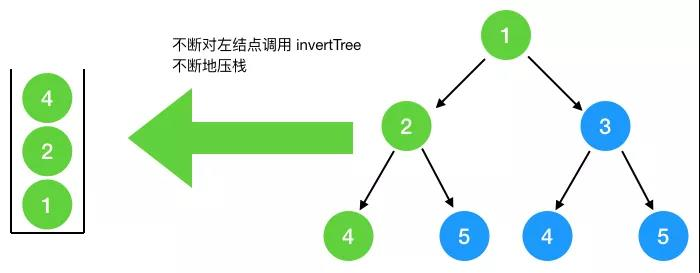

最坏情况，如果此二叉树类似是只有左节点，没有右节点，则树的高度即结点的个数 n，此时空间复杂度为 O(n)，总的来看，空间复杂度为O(n)


##### 中级题

汉诺塔问题：如下图所示，从左到右有A、B、C三根柱子，其中A柱子上面有从小叠到大的n个圆盘，现要求将A柱子上的圆盘移到C柱子上去，期间只有一个原则：一次只能移到一个盘子且大盘子不能在小盘子上面，求移动的步骤和移动的次数

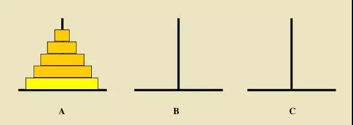

接下来套用我们的递归四步法看下这题怎么解

1.定义问题的递归函数，明确函数的功能，我们定义这个函数的功能为：把 A 上面的 n 个圆盘经由 B 移到 C

```go
// 将 n 个圆盘从 a 经由 b 移动到 c 上
func f(n int, pillar_A int, pillar_B int, pillar_C int)  {
	
}
```

2.查找问题与子问题的关系，首先我们看如果 A 柱子上只有两块圆盘该怎么移

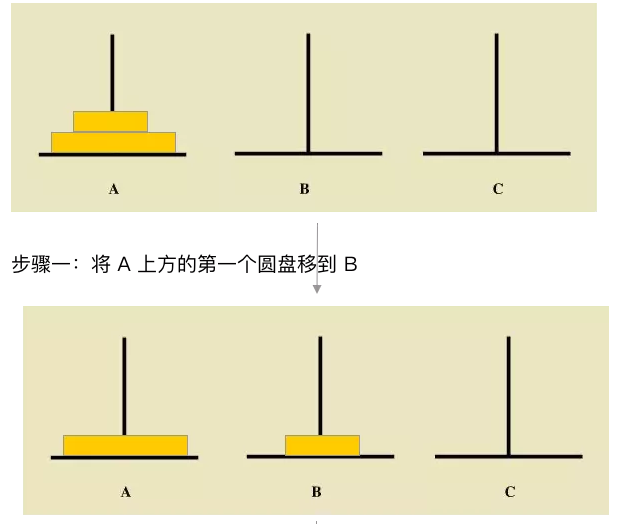

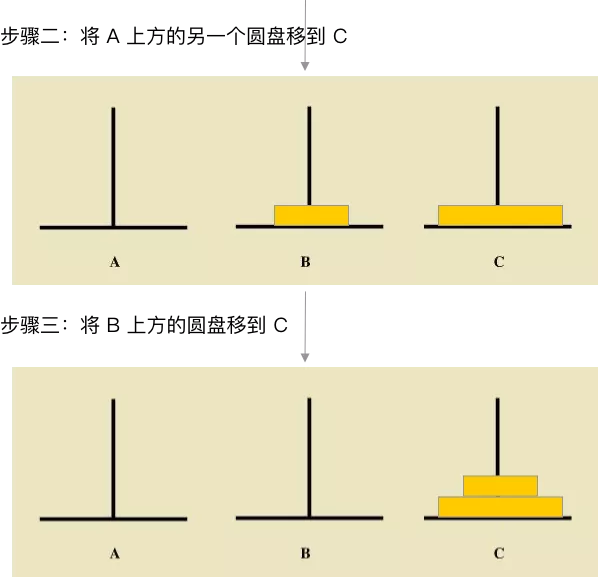

前面我们多次提到，分析问题与子问题的关系要采用自上而下的分析方式，要将 n 个圆盘经由 B 移到 C 柱上去，我们可以将上面的  n-1 个圆盘看成是一个圆盘，这样分析思路就与上面提到的只有两块圆盘的思路一致， 可以按以下几步来分析 

* 将上面的  n-1 个圆盘经由 C 移到 B 
* 此时将 A 底下的那块最大的圆盘移到 C 
* 再将 B 上的 n-1 个圆盘经由A移到 C上

有人问第一步的 n - 1 怎么从 C 移到 B，,重复上面的过程，只要把 上面的 n-2个盘子经由 A 移到 B, 再把 A 最下面的盘子移到 C，最后再把上面的 n - 2 的盘子经由 A 移到 B 下...,  怎么样，是不是找到规律了，不过在找问题的过程中 **切忌把子问题层层展开**，到汉诺塔这个问题上切忌再分析 n-3，n-4 怎么移，这样会把你绕晕，只要找到一层问题与子问题的关系得出可以用递归表示即可。

由以上分析可得

**move(n from A to C) = move(n-1 from A to B) + move(A to C) + move(n-1 from B to C)**

一定要先得出递归公式，哪怕是伪代码也好!这样第三步推导函数编写就容易很多，终止条件我们很容易看出，当 A 上面的圆盘没有了就不移了

3.根据以上的递归伪代码补充函数的功能

```go
// 将 n 个圆盘从 a 经由 b 移动到 c 上
func f(n int, pillar_A string, pillar_B string, pillar_C string)  {
	if n == 0 {
		return
	}
	// 将上面的 n-1 个圆盘经由 C 移到 B
	f(n - 1, pillar_A, pillar_C, pillar_B)
	
    // 此时将 A 底下的那块最大的圆盘移到 C
	fmt.Printf("%s -> %s\n", pillar_A, pillar_C)
	
    // 再将 B 上的 n-1 个圆盘经由A 移到 C上
	f(n - 1, pillar_B, pillar_A, pillar_C)
}
```

**从函数的功能**上看其实比较容易理解，整个函数定义的功能就是把 A 上的 n 个圆盘 经由 B 移到 C，由于定义好了这个函数的功能，那么接下来的把 n-1 个圆盘 经由 C 移到 B 就可以很自然的调用这个函数，所以**明确函数的功能非常重要**，按着函数的功能来解释，递归问题其实很好解析，**切忌在每一个子问题上层层展开死抠**，这样这就陷入了递归的陷阱，计算机都会栈溢出，何况人脑

4.时间复杂度分析 从第三步补充好的函数中我们可以推断出

f(n)  = 2^(n-1) + 2^(n-2) + ....+ 1

显然时间复杂度为 O(2^n)，很明显指数级别的时间复杂度是不能接受的，汉诺塔非递归解法比较复杂


##### 进阶题

现实中大厂中的很多递归题都不会用上面这些相对比较容易理解的题，更加地是对递归问题进行相应地变形， 来看下面这道题

> 细胞分裂 有一个细胞 每一个小时分裂一次，一次分裂一个子细胞，第三个小时后会死亡。那么n个小时后有多少细胞？

照样我们用前面的递归四步曲来解

1.定义问题的递归函数，明确函数的功能 我们定义以下函数为 n 个小时后的细胞数

```go 
func f(n int)  {
}
```

2.接下来寻找问题与子问题间的关系（即**递推公式**） 首先我们看一下一个细胞出生到死亡后经历的所有细胞分裂过程

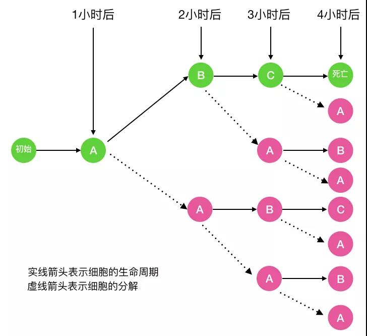

图中的 A 代表细胞的初始态， B代表幼年态(细胞分裂一次)， C 代表成熟态(细胞分裂两次)，C 再经历一小时后细胞死亡，以 f(n) 代表第 n 小时的细胞分解数，fa(n) 代表第 n 小时处于初始态的细胞数, fb(n) 代表第 n 小时处于幼年态的细胞数，fc(n) 代表第 n 小时处于成熟态的细胞数，则显然 **f(n) =  fa(n)  + fb(n)  + fc(n)**，那么 fa(n) 等于多少呢，以n = 4 （即一个细胞经历完整的生命周期）为例

仔细看上面的图

可以看出 **fa(n)  = fa(n-1) + fb(n-1) + fc(n-1),** 当 n = 1 时，显然 fa(1) = 1

fb(n) 呢，看下图可知 **fb(n)  = fa(n-1)**。当 n = 1 时  fb(n) = 0

fc(n) 呢,   看下图可知  **fc(n)  = fb(n-1)**。当 n = 1,2 时 fc(n) = 0

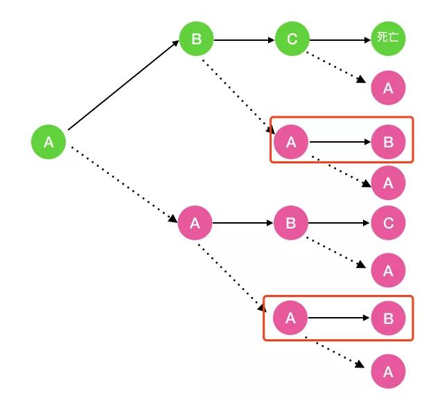

综上， 我们得出的递归公式如下

f(n) =  fa(n)  + fb(n)  + fc(n)

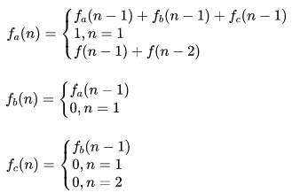

3.根据以上递归公式我们补充一下函数的功能

```go
func f(n int) int {
	return fa(n) + fb(n) + fc(n)
}

// 第 n 小时 a 状态的细胞数
func fa(n int)  int{
	if n == 1 {
		return 1
	}
	return fa(n - 1) + fb(n - 1) + fc(n - 1) 
}
// 第 n 小时 b 状态的细胞数
func fb(n int)  int{
	if n == 1 {
		return 0
	}
	return fa(n - 1)
}
// 第 n 小时 c 状态的细胞数
func fc(n int)  int{
	if n == 1 || n == 2 {
		return 0
	}
	return fb(n - 1)
}
```

只要思路对了，将递推公式转成代码就简单多了，另一方面也告诉我们，可能一时的递归关系我们看不出来，此时可以借助于画图来观察规律

4.求时间复杂度 由第二步的递推公式我们知道 f(n) = 2fa(n-1) + 2fa(n-2) + fa(n-3)

之前青蛙跳台阶时间复杂度是指数级别的，而这个方程式显然比之前的递推公式(f(n) = f(n-1) + f(n-2)) 更复杂的，所以显然也是指数级别的


#### 递归存在的问题

- 递归调用层级太多，导致栈溢出问题
  - 每一次函数调用在内存栈中分配空间，而每个进程的栈容量是有限的。
  - 当递归调用的层级太多时，就会超出栈的容量，从而导致调用栈溢出。
  - 递归过程类似于出栈入栈，如果递归次数过多，栈的深度就需要越深，最后栈容量真的不够
- 递归重复计算，导致效率低下


#### 总结

大部分递归题其实还是有迹可寻的， 按照之前总结的解递归的四个步骤可以比较顺利的解开递归题，一些比较复杂的递归题我们需要勤动手，画画图，观察规律，这样能帮助我们快速发现规律，得出递归公式，一旦知道了递归公式，将其转成递归代码就容易多了,很多大厂的递归考题并不能简单地看出递归规律，往往会在递归的基础上多加一些变形，不过万遍不离其宗，我们多采用**自顶向下**的分析思维，多练习，相信递归不是什么难事