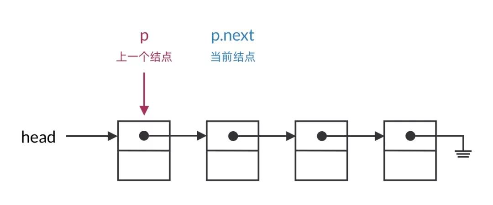
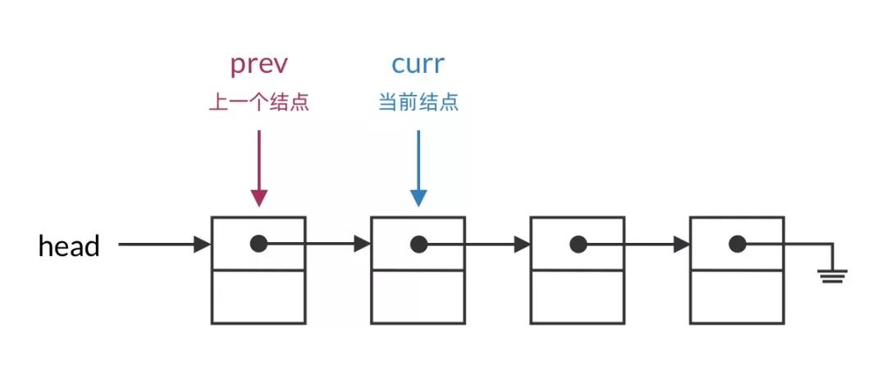
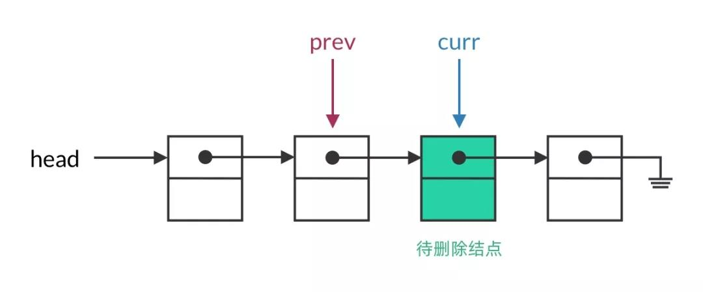
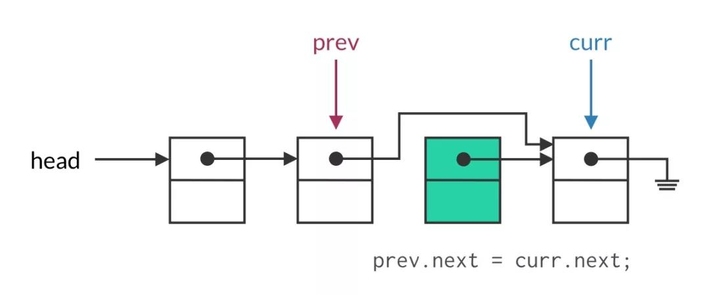

# 链表

## 链表遍历的基本框架

单链表操作的本质难度在哪里？相比于双向链表，单链表缺少了指向前一个结点的指针，所以在删除结点时，还需要持有前一个结点的指针。这让遍历过程变得麻烦了许多。

比较容易想到的方法是将遍历的指针指向“前一个结点”，删除结点时使用 `p.next = p.next.next`。但这个方法会带来一些心智负担：

- 每次要查看的结点是 `p.next`，也就是下一个结点，别扭
- 循环终止条件不是 `p == null` 而是 `p.next == null`，容易出错



实际上，这就是单链表操作的复杂性所在。我们前面也否定了使用二级指针这样的高级技巧来简化操作的方法，那么，有没有更简单明了的遍历方式呢？答案是有的。这里隆重推荐我一直在使用的**链表遍历框架**：

当删除链表结点时，既需要访问当前结点，也需要访问前一个结点。既然这样，我们不妨使用两个指针来遍历链表，`curr` 指针指向当前结点，`prev` 指针指向前一个结点。这样两个指针的语义明确，也让你写出的代码更易理解。



用代码写出来，链表遍历的框架是这样的：

```cc
ListNode prev = null;
ListNode curr = head;
while (curr != null) {
    // 进行操作，prev 表示前一个结点，curr 表示当前结点
    if (prev == null) {
        // curr 是头结点时的操作
    } else {
        // curr 不是头结点时的操作
    }
    prev = curr;
    curr = curr.next;
}
```

在遍历的过程中，需要一直维护 `prev` 是 `curr` 的前一个结点。`curr` 是循环中的主指针，整个循环的起始和终止条件都是围绕 `curr` 进行的。`prev` 指针作为辅助指针，实际上就是记录 `curr` 的上一个值。

在每一轮遍历中，可以根据需要决定是否使用 `prev` 指针。注意 `prev` 可能为 null（此时`curr`是头结点），在使用前需要先进行判断。





##### 1.[ 反转链表](https://leetcode-cn.com/problems/reverse-linked-list/)

## 链表基本算法

#### 双指针

使用两个指针一快一慢同时遍历链表。

##### 1.链表中点位置节点

快慢指针从头节点同时出发，快指针一次前进两个节点，速度是慢指针两倍，快指针到链尾时慢指针位置既为中点。

##### 2.[删除链表的倒数第N个节点](https://leetcode-cn.com/problems/remove-nth-node-from-end-of-list/)

快指针先走N步，然后两个指针以同样的速度前进，快指针到链表尾时慢指针为倒数第N个节点的前驱节点。

##### 3.[环形链表](https://leetcode-cn.com/problems/linked-list-cycle/)

当链表中存在环时，两个指针会在环中相遇，即指向同一个节点。

##### 4.[环形链表 II](https://leetcode-cn.com/problems/linked-list-cycle-ii/)

判断出链表中存在环且知道相遇的节点，让其中任一个指针指向头节点，另一指针指向相遇的节点，两个指针以相同速度前进，再次相遇时的节点即为环的起点。

##### 5.环形链表 III

判断出链表中存在环且知道相遇的节点，其中任一个指针每次前进1步，另一个不动，下次再相遇时前进的步数即为环的长度。

##### 6.[相交链表](https://leetcode-cn.com/problems/intersection-of-two-linked-lists/)

这里不叫快慢指针，用两个指针`a` ,`b`分别指向A,B两个链表头，当 `a`到链表`A`的尾时，将它重新指向到链表` B`，类似的，对`b`进行同样操作。当 `a`, `b`相遇，则相遇时的节点即为相交结点。

##### 7.[反转链表](https://leetcode-cn.com/problems/reverse-linked-list/)

这里不叫快慢指针，用两个指针`a` ,`b`，`a` 在前 `b`在后。每次让 `a` 的`next` 指向 `b` ，实现一次局部反转，局部反转完成之后，` a `和 `b`同时前进一步，循环上述过程，直至 `a`到达链表尾部

#### 哨兵结点

哨兵节点广泛应用于树和链表中，如伪头、伪尾、标记等，它们是纯功能的，通常不保存任何数据，其主要目的是使链表标准化，如使链表永不为空、永不无头、简化插入和删除。

#### 入栈出栈

利用栈的先进后出的原则

##### 1.[两数相加 II](https://leetcode-cn.com/problems/add-two-numbers-ii/)

分别遍历两个链表将其中节点依次入两个栈，再依次取出相加，同时处理好进位问题即可。

##### 2.[删除链表的倒数第N个节点](https://leetcode-cn.com/problems/remove-nth-node-from-end-of-list/)

遍历链表将所有节点依次入栈。根据先进后出的原则，我们弹出栈的第 n 个节点就是需要删除的节点，并且目前栈顶的节点就是待删除节点的前驱节点。