# 链表

## 链表遍历的基本框架

单链表操作的本质难度在哪里？相比于双向链表，单链表缺少了指向前一个结点的指针，所以在删除结点时，还需要持有前一个结点的指针。这让遍历过程变得麻烦了许多。

比较容易想到的方法是将遍历的指针指向“前一个结点”，删除结点时使用 `p.next = p.next.next`。但这个方法会带来一些心智负担：

- 每次要查看的结点是 `p.next`，也就是下一个结点，别扭
- 循环终止条件不是 `p == null` 而是 `p.next == null`，容易出错


实际上，这就是单链表操作的复杂性所在。我们前面也否定了使用二级指针这样的高级技巧来简化操作的方法，那么，有没有更简单明了的遍历方式呢？答案是有的。这里隆重推荐我一直在使用的**链表遍历框架**：

当删除链表结点时，既需要访问当前结点，也需要访问前一个结点。既然这样，我们不妨使用两个指针来遍历链表，`curr` 指针指向当前结点，`prev` 指针指向前一个结点。这样两个指针的语义明确，也让你写出的代码更易理解。


用代码写出来，链表遍历的框架是这样的：

```cc
ListNode prev = null;
ListNode curr = head;
while (curr != null) {
    // 进行操作，prev 表示前一个结点，curr 表示当前结点
    if (prev == null) {
        // curr 是头结点时的操作
    } else {
        // curr 不是头结点时的操作
    }
    prev = curr;
    curr = curr.next;
}
```

在遍历的过程中，需要一直维护 `prev` 是 `curr` 的前一个结点。`curr` 是循环中的主指针，整个循环的起始和终止条件都是围绕 `curr` 进行的。`prev` 指针作为辅助指针，实际上就是记录 `curr` 的上一个值。

在每一轮遍历中，可以根据需要决定是否使用 `prev` 指针。注意 `prev` 可能为 null（此时`curr`是头结点），在使用前需要先进行判断。


## 链表基本算法

#### 反转链表

反转链表的题目会有一个隐藏的要求：不能创建新的链表结点，只是在原有结点上修改链表指针。这样的原地操作会比生成一个新的链表要难很多。

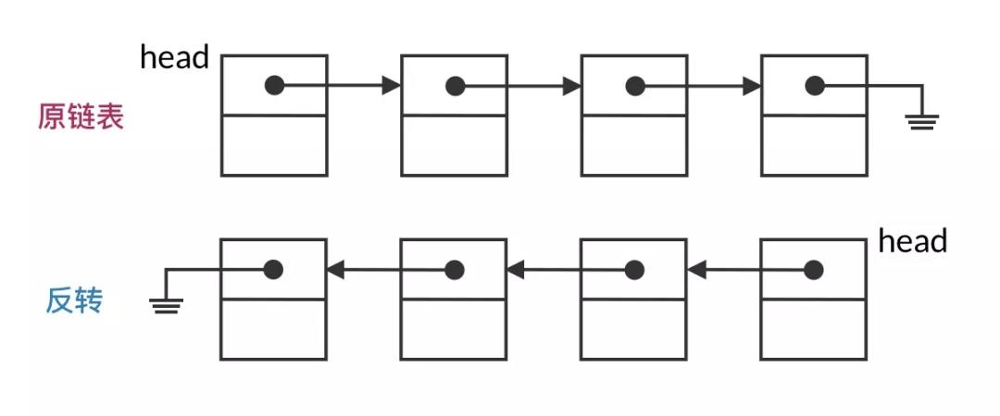

##### 1.套用框架

这道题实际上就是一个典型的链表的遍历-处理的操作，于是我们套用使用上面所讲的链表遍历框架。要反转链表，实际上就是要反转所有相邻结点之间的指针。那么，整体的代码框架应该是：

```c
ListNode prev = null;
ListNode curr = head;
while (curr != null) {
    // 反转 prev 和 curr 之间的指针
    prev = curr;
    curr = curr.next;
}
```

可以看到，遍历的框架已经将整体的思路架构了出来，我们知道按照如此的方式一定能遍历到所有相邻的结点对，也知道遍历结束后循环一定能正常退出。接下来只需要关注每一步如何反转结点之间的指针即可。

##### 2.单步处理

单步操作是“反转 `prev` 和 `curr` 之间的指针”。这里涉及到指针指向的改变，需要小心指针丢失的问题。在思考的时候，要考虑到和前一步、后一步的链接。

假设现在遍历到了链表中部的某个结点。链表应该会分成两个部分：`prev` 指针之前的一半链表已经进行了反转；`curr` 之后的一半链表还是原先的顺序。这次循环将让 `curr` 的指针改为指向 `prev`，就将当前结点从后一半链表放进了前一半链表。

循环开始时，prev 和 curr 分别指向链表的前半部分和后半部分

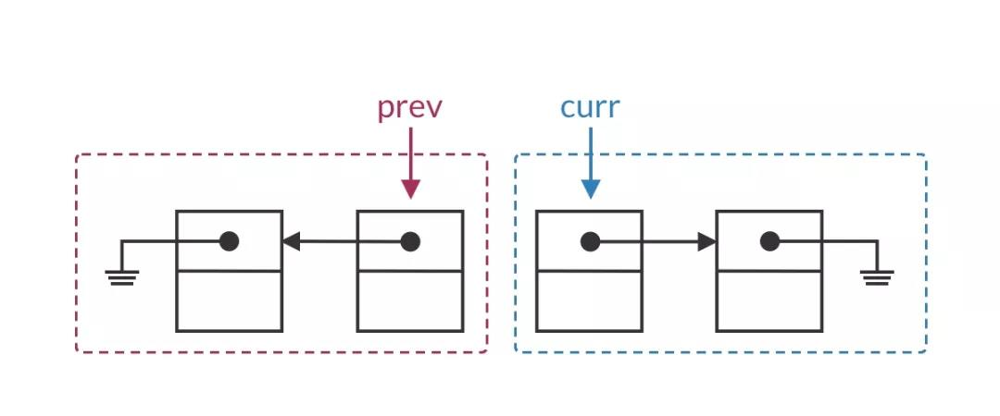

将当前结点放入前一半链表

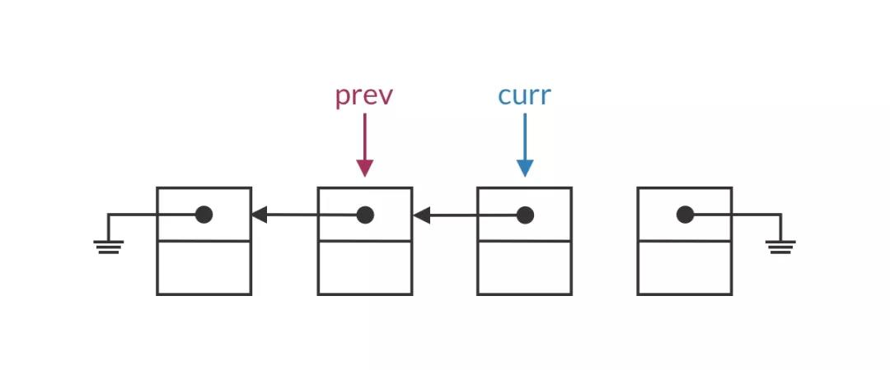

下一轮循环时，prev 和 curr 仍然分别指向链表的前半部分和后半部分

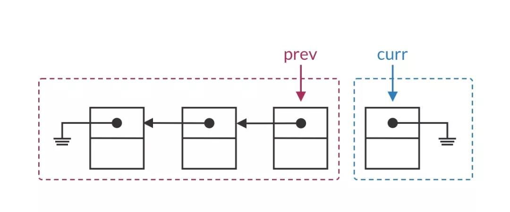

而头结点的特殊情况是，全部链表都还未进行反转，即前一半链表为空。显然`curr.next` 应当置为 null。

当前结点为头结点时，前一半链表为空

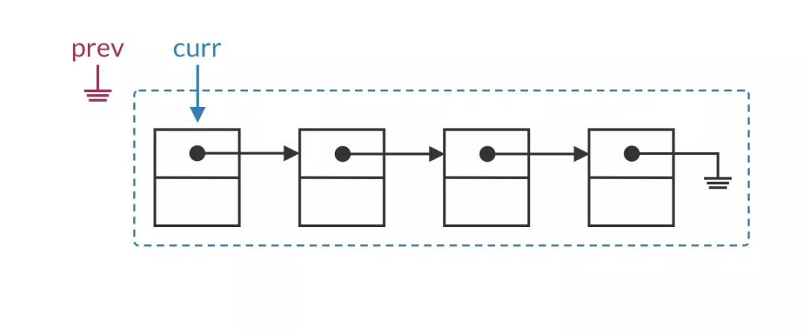

将 curr.next 置空，当前结点成为前一半链表的唯一结点

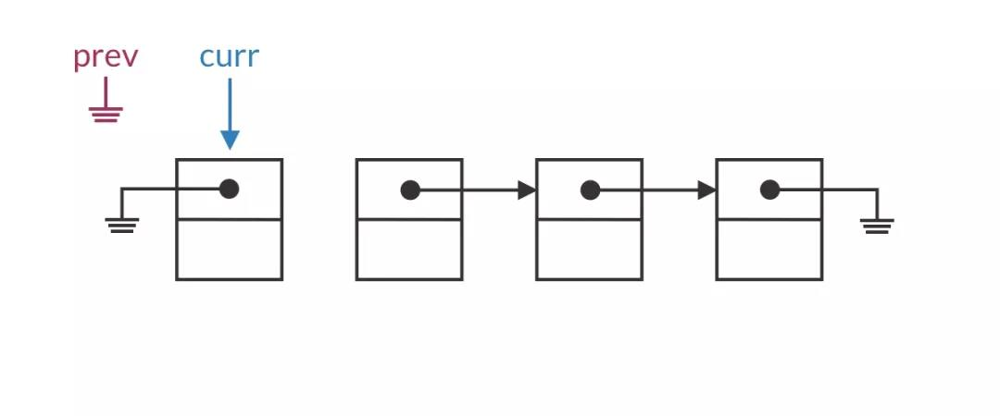

将单步操作放入代码框架，我们就得到了一份初版的解题代码：

```c
ListNode prev = null;
ListNode curr = head;
while (curr != null) {
    if (prev == null) {
        curr.next = null;
    } else {
        curr.next = prev;
    }
    prev = curr;
    curr = curr.next;
}
```

##### 3.细节处理

上面的代码已经基本上比较完整了，但是还存在着明显的错误，那就是存在**指针丢失**的问题。

我们使用 `curr.next = prev` 来反转指针，但这会覆盖掉 `curr.next` 本来存储的值。丢掉这个指针之后，链表的后续结点就访问不到了！

直接赋值 curr.next 是错误的，我们会丢掉指向下一个结点的指针

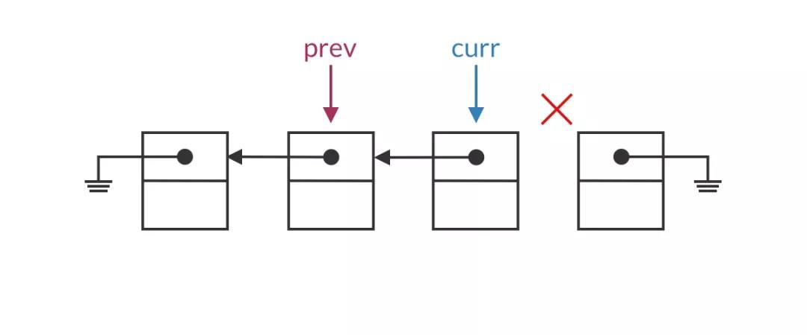

要解决指针丢失的问题也很简单，使用一个临时指针保存 `curr` 的下一个结点即可。如下图所示：

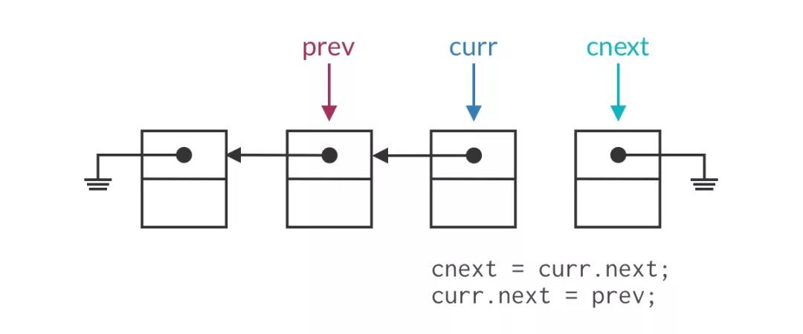

不过这样一来，我们遍历框架中更新指针的操作也要随之进行微调。框架本来就不是一成不变的，需要根据实际题目灵活调整。

根据以上两点的细节处理，我们修改得到完整版的代码：

```c
ListNode reverseList(ListNode head) {
    ListNode prev = null;
    ListNode curr = head;
    while (curr != null) {
        ListNode cnext = curr.next;
        if (prev == null) {
            curr.next = null;
        } else {
            curr.next = prev;
        }
        prev = curr;
        curr = cnext;
    }
    return prev;
}
```

上述代码中，if 的两个分支实际上可以优化合并，这里为了清晰起见仍然保留分支。


#### 环形链表

##### 1.链表是否有环

这道题其实是一道非常新颖的题目，**考察的是对链表知识的综合掌握**。只靠背链表的遍历代码来解题的人，看到这道题会手足无措。因为链表加上环之后，普通的遍历代码根本就不管用了！

```c
ListNode traverse(ListNode head) {
    ListNode q = head
    while (q != null) {   
    	q = q.next) 
        // ...
    }
}
```

上面的这段遍历代码，在有环路的链表上，会陷入「无限循环」：指针 `q` 在环路中一直绕圈，永远到达不了结束条件 `q == null` 。

其实看到前面的链表遍历代码，很多同学应该已经想出这道题的解题关键点了：

**我只要顺着链表遍历，如果循环能正常退出（遇到 `q == null` 的情况），那么链表无环；如果循环永远不能退出，那么链表有环。**

那么难点又来了，如果循环永远不能退出，我们的代码根本结束不了，不能返回「链表有环」的结果……

> **面试小贴士：**
>
> 在面试中，我们经常会遇到以上的情况。自己有了一点思路，但是还不能确定思路对不对。这时候，我们要做的不是「闷头苦想」直到想出最终解法，而是应该及时把自己关键的思路说给面试官。
>
> 面试中最忌讳的是长时间的沉默。及时跟面试官反馈我们初步的思路，可以确定我们的思路是否正确。即使一开始一点思路都没有，也可以直接说出来，请面试官给一点提示。

此时，面试官会告诉我们，以上的思路是正确的。接下来，我们需要能够判断链表有环的情况，并及时退出循环。

那么究竟如何判断呢？可以使用朴素的「哈希表」方案，或者是巧妙的「双指针」方法，下面会分别介绍。


- **哈希法**

哈希表解法的基本思路是：**把访问过的结点记录下来，如果在遍历中遇到了访问过的结点，那么可以确定链表中存在环**。记录访问过的结点，最常用的方法就是使用哈希表了。

有了这一点思路之后，我们很快可以写出相应的题解代码：

```java
public boolean hasCycle(ListNode head) {
    // 记录已访问过的结点
    Set<ListNode> seen = new HashSet<>();
    for (ListNode q = head; q != null; q = q.next) {
        if (seen.contains(q)) {
            // 遇到已访问过的结点，确定链表存在环
            return true;
        }
        seen.add(q);
    }
    // 遍历循环正常退出，链表不存在环
    return false;
}
```

这样，我们就成功地解决了这道题目。

但接下来面试官会让我们分析算法的时间、空间复杂度。发现空间复杂度是 O(n)之后，面试官会让我们再写一个空间复杂度更低的解法，也就是说，我们不能使用哈希表这样的额外存储空间了。


- **双指针法**

在面试中，做出上面的哈希表解法属于「基本达标」，可以打 70 分了，但是如果要让面试官青睐你，打到 90 分，还要能写出不使用额外存储空间的解法，也就是双指针解法。

实话说，要在面试中凭空想出双指针解法有点困难。因此，这要靠我们平时的积累，多见识不同的解题技巧，这样在面试中可以熟练运用。

链表中的双指针技巧也叫「快慢指针」，指的是用两个指针一快一慢同时遍历链表。

例如，**寻找链表中点**的操作。使用一快一慢两个指针。快指针一次前进两个结点，速度是慢指针的两倍。当快指针到达链表尾部时，慢指针正好到达的链表的中部，这样就找到的链表的中点，非常巧妙。遍历过程如下图所示。

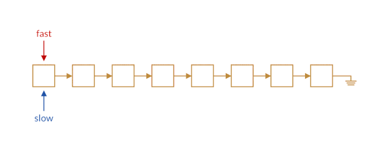

如果我们熟悉这个技巧，就可以在环形链表这道题中触类旁通，使用出快慢指针技巧。

我们让快指针一次前进两个结点，慢指针一次前进一个结点。当快慢指针都进入环路时，快指针会将慢指针「套圈」，从后面追上慢指针，如下图所示。

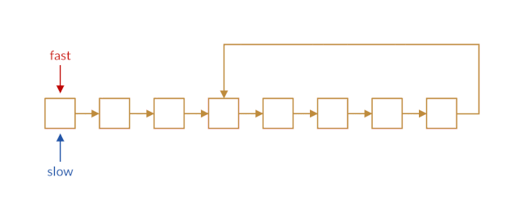

这样，如果快指针追上了慢指针，我们就可以判断链表中存在环路。而如果链表中不存在环的话，快指针会永远走在慢指针的前面，它们不会相遇。

依照这个思路，我们可以写出以下的题解代码。

```java
public boolean hasCycle(ListNode head) {
    ListNode fast = head;
    ListNode slow = head;
    while (fast != null && fast.next != null) {
        fast = fast.next.next;
        slow = slow.next;
        // fast 和 slow 指向同一个结点，说明存在“套圈”
        if (fast == slow) {
            return true;
        }
    }
    // fast 到达链表尾部，则不存在环
    return false;
}
```


##### 2.环状链表环长


##### 3.环状链表起点

当你用双指针解决了「判断环形链表」的题目之后，面试官看你答得不错，可能会继续追问，如何寻找环形链表的环的起点？

如果用哈希表的方法，这道题其实和前一题是一样的，没什么难度。因此，面试官要求你用双指针的方法寻找链表环的起点。

乍一看来，这道题挺难的。我们可以用快慢指针的方法知道链表中是否存在环，但我们不知道两个指针相遇在什么位置，要找到环的起点就更难了。不过不要慌，我们先画个图看看两个指针相遇的过程：

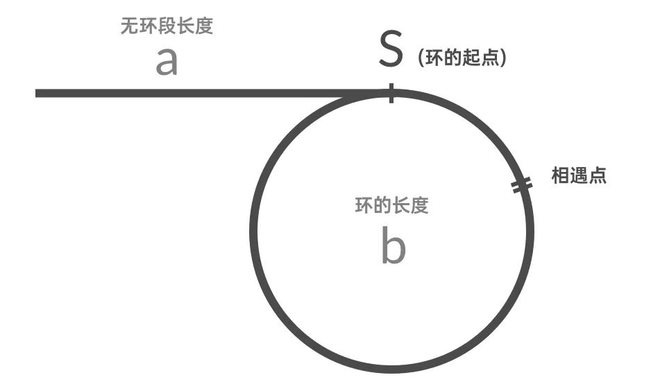

如上图所示，链表分为两段：无环段和有环段。我们设无环段的长度为a，环的长度为b。当快慢指针相遇时，我们设慢指针已经走了 x 步，那么快指针这时候已经走了 2x 步。快指针套圈了慢指针，也就是比慢指针多走了若干圈。我们可以列出公式：2x - x = k * b

其中，k 可以是任意正整数，因为快指针可能套了慢指针不止一圈。将上式化简得到 : x = k * b

这个恰好是慢指针走的步数。也就是说，慢指针目前前进的 x 步，正好是环的长度 b 的整数倍。

那么，**慢指针再走a步，就可以正好到达环的起点**（图中的 S 点）。这是因为 x + a = a + k *b 

正好够从链表头部出发，走一段无环段（a），再把有环段走 k 圈（k * b）。

如果我们在此时再用一个指针 `q` 从链表头部出发。那么指针 `q` 和慢指针 `slow` 会在走了 步以后恰好在环的起点处相遇。这样，我们就可以知道环的起点了。

根据以上思路，我们可以写出下面的题解代码：

```java
public ListNode detectCycle(ListNode head) {
    ListNode fast = head;
    ListNode slow = head;
    while (fast != null && fast.next != null) {
        fast = fast.next.next;
        slow = slow.next;
        // 快慢指针相遇，说明链表存在环
        if (fast == slow) {
            // 此时 slow 指针距离环的起点的距离恰好为 a
            ListNode q = head;
            while (q != slow) {
                slow = slow.next;
                q = q.next;
            }
            // slow 和 q 相遇的位置一定是环的起点
            return slow;
        }
    }
    // 链表不存在环，返回 null
    return null;
}
```


##### 4.环状链表链表长